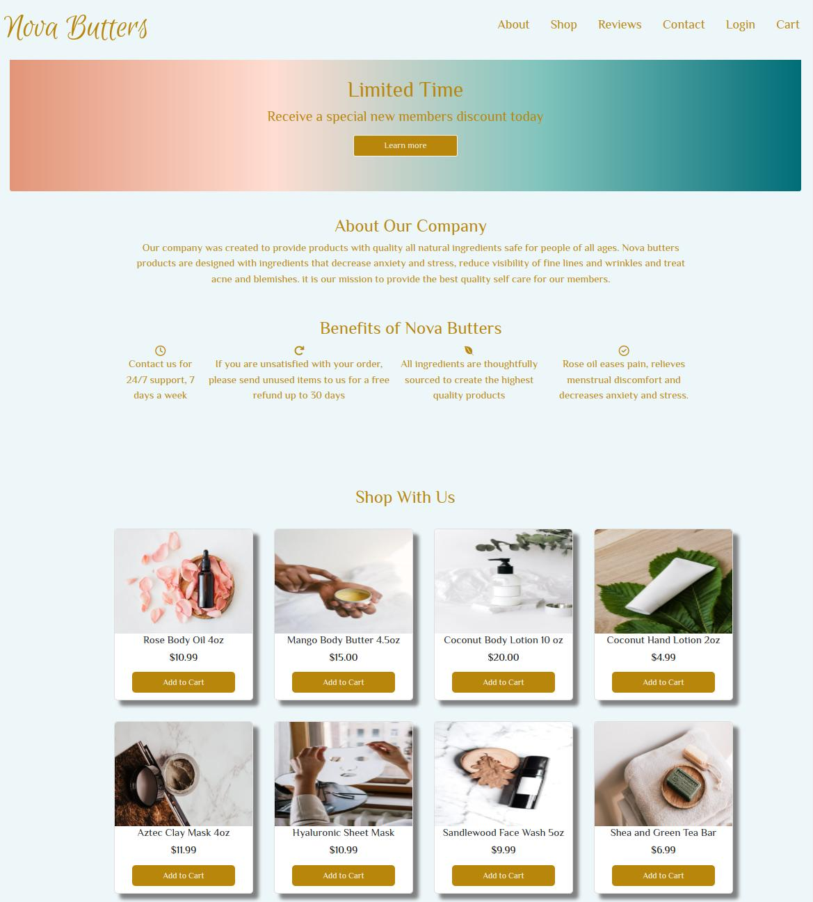

# General Assembly Final Project- Landing Page

## About This Project
Nova Butters landing page is the final project I completed for the General Assembly Front-End Web Development Bootcamp. Students were tasked to create a landing page of their choice utilizing skills learned during the bootcamp in HTML, CSS and JavaScript. W3 Schools was a huge resource for CSS styling options, especially 'cards' and different ways to style them.

### Built With
* HTML
* CSS
* JavaScript
* Bootstrap

## Acknowledgements
* [W3 Schools](https://www.w3schools.com/)
* [Font Awesome](https://fontawesome.com/)
* [Google Fonts](https://fonts.google.com/)
* [Pexels- free stock photos](https://www.pexels.com/)

## Author
- Kendra Ward - [@KNWard](https://github.com/KNWard)